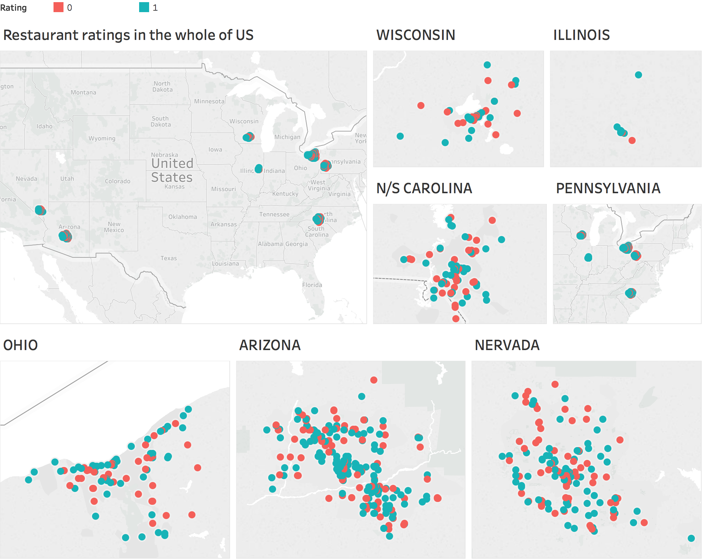
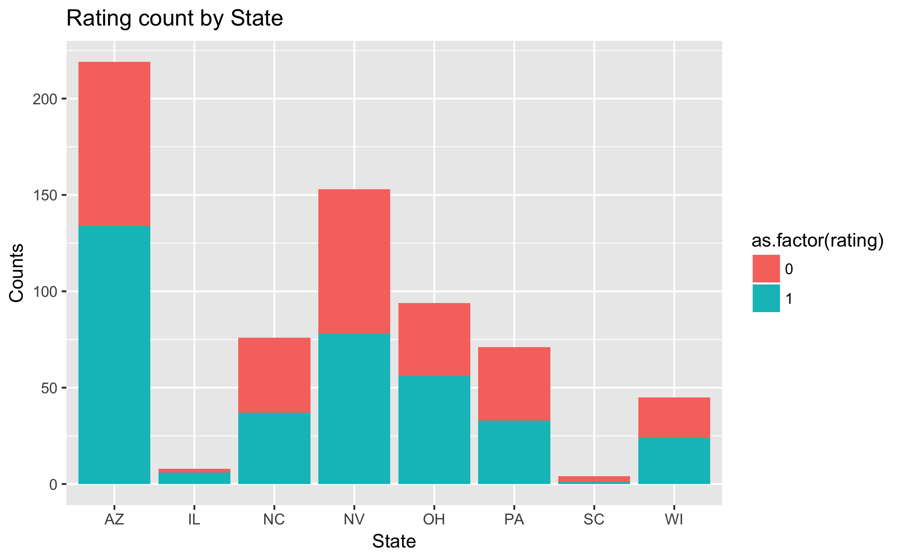
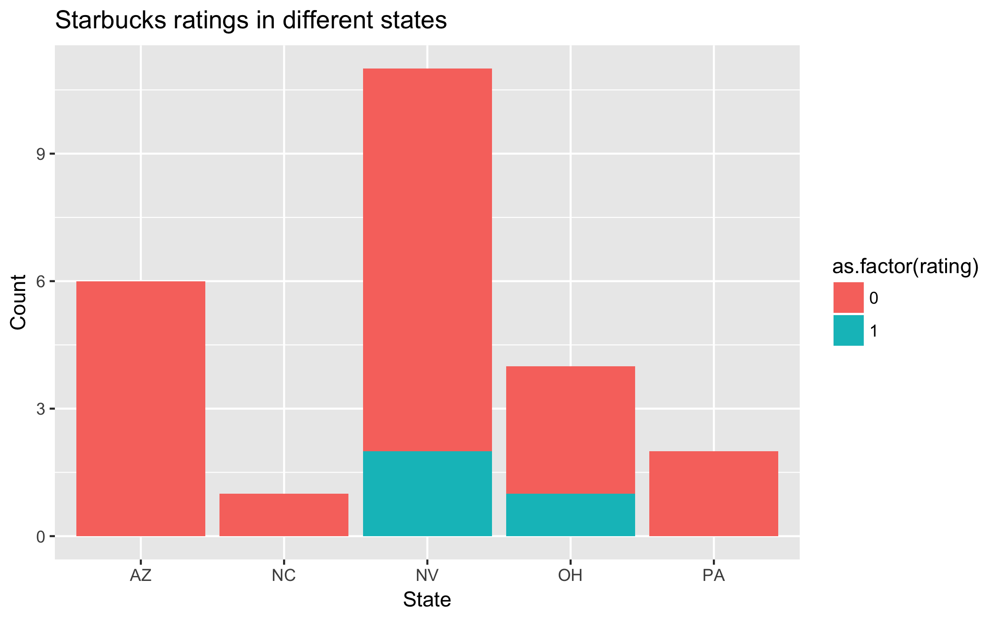
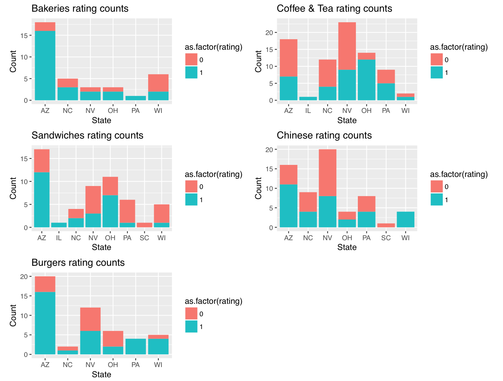

```{r setup, include=FALSE}
knitr::opts_chunk$set(echo = TRUE)
```
The set of questions below address the task of predicting the merit of a restaurant on Yelp. Each restaurant is described by a set of business attributes, and is accompanied by a set of text reviews from customers. For the purpose of the problems below, the average rating (originally on a scale from 0 to 5) was converted into a binary variable depending on whether the average was above 3.5, in which case it is considered "good" (labeled 1), or below 3.5 in which case it is considered "bad" (labeled 0). The overall goal is to predict these binary ratings from the information provided.

The data are split into a training and test set and are in the files `dataset_1_train.txt` and `dataset_1_test.txt` respectively. The first column contains the rating for the restaurant (0 or 1), columns 2-21 contain the business attributes, and columns 22-121 contain text features extracted from the customer reviews for the restaurant. The details about the business attributes are provided in the file `dataset_1_description.txt`. 

We use the bag-of-words encoding to generate the text features, where the set of reviews for a restaurant are represented by a vector of word counts. More specifically, we construct a dictionary of 100 frequent words in the customer reviews, and include 100 text features for each restaurant: the $i$-th feature contains the number of times the dictionary word $i$ occurs in customer reviews for the restaurant. For example, a text feature 'fantastic' with value 18 for a restaurant indicates that the word 'fantastic' was used a total of 18 times in customer reviews for that restaurant.

# Problem 1 [20 points]

Does the location of a restaurant relate to its rating?  Construct a compelling visualization to address this question, and write a brief (under 300 words) summary that clearly explains your analysis and conclusions to someone without a data science background.

**Answer**

In this section, we load and explore the data sets before writing our report. Tableau is also used in assisting analysis. 

## Data exploration 
```{r}

# load data
train <- read.csv('./cs109b-midterm1-data/dataset_1_train.txt')
test <- read.csv('./cs109b-midterm1-data/dataset_1_test.txt')

str(train)
```

# Location-related attributes: 

```{r}
library(ggplot2)

ggplot(train, aes(x = as.factor(postal_code), fill = as.factor(rating)))+
  geom_bar()+
  labs(x = 'Postal Code', y = 'Counts', title = 'Rating count by Postal Code')

ggplot(train, aes(x = as.factor(city), fill = as.factor(rating)))+
  geom_bar()+
  labs(x = 'City', y = 'Counts', title = 'Rating count by City')

ggplot(train, aes(x = as.factor(state), fill = as.factor(rating)))+
  geom_bar()+
  labs(x = 'State', y = 'Counts', title = 'Rating count by State')

# ggsave(filename = 'state_bar.png', plot = last_plot(),
#   scale = 1, width = par("din")[1], height = par("din")[2], units = c("in",
#           "cm", "mm"), dpi = 300)
```

Plot of rating counts by postal code and city are not very telling, as there are too many postal codes and cities. Also, it is difficult to tell the proximity of different cities from one another from the plot above. Even though there are some postal codes / cities with only good or bad ratings, the number of data points are too few to make any conclusive statement. 

A map analysis from Tableau shows us that most data points in each state are concentrated around one major city, such as Las Vegas in Nevada, Pheonix in Arizona, etc, and there is only one cluster in each state. Hence, it makes sense to examine if there is any relation between a restaurant's rating and which state it is located in. 

We examine the percentage of good and bad ratings in each state:

```{r}
# percentage good/bad rating in each state 
states <- levels(train$state)

# initialization 
percentage.good <- list()
percentage.bad <- list()
ratio.good.bad <- list() # ratio of number of good ratings / bad ratings

# calculate percentages
for(i in states){
  data <- train[train$state == i,] # extract entries from the ith state 
  percentage.good[[i]] <- mean(data$rating == 1)
  percentage.bad[[i]] <- mean(data$rating == 0) 
  ratio.good.bad[[i]] <- percentage.good[[i]] / percentage.bad[[i]] 
}

cat('Percentage of restaurants rated good and bad according to state')
data.frame(state = states,
           percentage.good = as.numeric(percentage.good),
           percentage.bad = as.numeric(percentage.bad),
           ratio.good.bad = as.numeric(ratio.good.bad))

```

- In Arizona and Ohio, the percentage of restaurants rated good are about 1.5 times the percentage of those rated bad. 

- In North Carolina, Nevada, Pennsylvania, and Wisconsin, the percentage of restaurants rated good and bad are about the same. 

- The ratings in  Illinois and South Carolina are skewed to mostly good and mostly bad, respectively. However, there are too few restaurant data points in either state to make any conclusion. 

It would be helpful if we have additional infomation about the proximity of restaurants to places of interest, significant landmarks, town centers, highway, train or bus stations, etc, and this would give us a better idea of whether a restaurant's rating is related to its location other than the state it is in. However, since such information is not availabe, we base our analysis on states only.  

Let's take a closer look at the different business attributes:

```{r}

summary(train[1:21])

```

# Comparing the same chain restaurant Starbucks across the country 

Here, we see that there are 24 Starbucks (25 if including a Starbucks in Mandarin hotel) located all across the country. It may be useful to compare how the same restaurant chain performs at different locations. In the visualization below, we see that Starbucks is mostly rated as 'bad' independent of its location. 

```{r}
starbucks <- train[train$name == 'Starbucks',]

ggplot(starbucks, aes(x = as.factor(state), fill = as.factor(rating)))+
  geom_bar()+
  labs(x = 'State', y = 'Count', title = 'Starbucks ratings in different states')

# ggsave(filename = 'starbucks.png', plot = last_plot(),
#   scale = 1, width = par("din")[1], height = par("din")[2], units = c("in",
#           "cm", "mm"), dpi = 300)
```

# Restaurant ratings in different states based on cuisine

```{r fig.height = 7, fig.width = 9}
library(gridExtra)

levels(train$cuisine)

bakeries <- train[train$cuisine == 'Bakeries',]
bars <- train[train$cuisine == 'Bars',]
Italian <- train[train$cuisine == 'Italian', ]
Pizza <- train[train$cuisine == 'Pizza', ]
fast.food <- train[train$cuisine == 'Fast Food', ]
ct <- train[train$cuisine == 'Coffee & Tea', ]
Sandwiches <- train[train$cuisine == 'Sandwiches', ]
Mexican <- train[train$cuisine == 'Mexican', ]
bb <- train[train$cuisine == 'Breakfast & Brunch', ]
Chinese <- train[train$cuisine == 'Chinese', ]
Burgers <- train[train$cuisine == 'Burgers', ]


p <- list()


p[[1]] <- ggplot(bakeries, aes(x = as.factor(state), fill = as.factor(rating)))+
  geom_bar()+
  labs(x = 'State', y = 'Count', title = 'Bakeries rating counts')

p[[2]] <- ggplot(bars, aes(x = as.factor(state), fill = as.factor(rating)))+
  geom_bar()+
  labs(x = 'State', y = 'Count', title = 'Bars rating counts')

p[[3]] <- ggplot(Italian, aes(x = as.factor(state), fill = as.factor(rating)))+
  geom_bar()+
  labs(x = 'State', y = 'Count', title = 'Italian rating counts')

p[[4]] <- ggplot(Pizza, aes(x = as.factor(state), fill = as.factor(rating)))+
  geom_bar()+
  labs(x = 'State', y = 'Count', title = 'Pizza rating counts')

p[[5]] <- ggplot(fast.food, aes(x = as.factor(state), fill = as.factor(rating)))+
  geom_bar()+
  labs(x = 'State', y = 'Count', title = 'Fast Food rating counts')

p[[6]] <- ggplot(ct, aes(x = as.factor(state), fill = as.factor(rating)))+
  geom_bar()+
  labs(x = 'State', y = 'Count', title = 'Coffee & Tea rating counts')

p[[7]] <- ggplot(Sandwiches, aes(x = as.factor(state), fill = as.factor(rating)))+
  geom_bar()+
  labs(x = 'State', y = 'Count', title = 'Sandwiches rating counts')

p[[8]] <- ggplot(Mexican, aes(x = as.factor(state), fill = as.factor(rating)))+
  geom_bar()+
  labs(x = 'State', y = 'Count', title = 'Mexican rating counts')

p[[9]] <- ggplot(bb, aes(x = as.factor(state), fill = as.factor(rating)))+
  geom_bar()+
  labs(x = 'State', y = 'Count', title = 'Brunch & Breakfast rating counts')

p[[10]] <- ggplot(Chinese, aes(x = as.factor(state), fill = as.factor(rating)))+
  geom_bar()+
  labs(x = 'State', y = 'Count', title = 'Chinese rating counts')

p[[11]] <- ggplot(Burgers, aes(x = as.factor(state), fill = as.factor(rating)))+
  geom_bar()+
  labs(x = 'State', y = 'Count', title = 'Burgers rating counts')

do.call(grid.arrange, p)

```

If we look at a particular type of cuisine, certain states tend to give better rating on a single type of cuisine compared to the rests. 

  - Bakeries: Arizona 89% good; 
  
  - Coffee and tea: Ohio 86% good; 
  
  - Sandwiches: Pennsylvania 83% bad, Wiscosin 80% bad, Arizona 71% good, Nevada 67% bad;
  
  - Chinese:  Wisconsin 100% good, Arizona 69% good;
  
  - Burgers: Pennsylvania 100% good, Arizona 80% good, Wisconsin 80% good 
  
  
  
```{r}
# percentage good/bad rating in each state for selected cuisines 
cuisine.selected <- c('Bakeries', 'Coffee & Tea', 'Sandwiches', 'Chinese', 'Burgers')

# calculate percentages
for(i in 1:length(cuisine.selected)){
  percentage.good <- list()
  percentage.bad <- list()
  for(j in 1:length(states)){
    data <- train[train$state == states[[j]] & train$cuisine == cuisine.selected[[i]],]
    percentage.good[[j]] <- mean(data$rating == 1)
    percentage.bad[[j]] <- mean(data$rating == 0) 
  }
  
  cat('Cuisine:', cuisine.selected[[i]], '\n')
  print(data.frame(state = states,
                   percentage.good = round(as.numeric(percentage.good),2),
                   percentage.bad = round(as.numeric(percentage.bad),2)))
  cat('\n')
}
```
  
-------

# 300 WORDS SUMMARY: 

# The relationship between a restaurant's rating and its location 

**Within each state, a restaurant's rating is largely independent of its location.** Figure 1 shows the scatter plot of restaurants' ratings in every state. There is no particular cluster or pattern relating a restaurant's location to its rating within each state. 

However, **a restaurant's rating is dependent on the state it is located in.** In **North Carolina, Nevada, Pennsylvania**, and **Wisconsin**, the number of restaurants rated as `good` and `bad` are similar in numbers. In **Arizona** and **Ohio**, restaurants are rated `good` **~1.5x more often** than `bad`, while in **Illinois** restaurants are overwhelmingly rated as `good`, and in **South Carolina**  overwhelmingly rated as `bad`. However, there are too few data points in either state to draw conclusive statements. This statistics is summarized in Figure 2. 

## Performance of Starbucks across the country
To find out if location truely affects a restaurant's rating, it is perhaps fair to compare how one specific restaurant is rated in different locations. Here, we compare the ratings of 25 **Starbucks**  across the country. Figure 3 shows that Starbucks is mostly rated as 'bad' independent of its location. 

## Cuisine specific restaurant rating vs location 
So far we have looked at all restaurants as a whole. If instead, we were to examine restaurants of a particular type of cuisine, we realize that **certain states tend to give overwhelmingly better ratings for a particular type of cuisine** compared to other states. The bar charts in Figure 4 shows that restaurants serving **bakery goods, coffee & tea, sandwiches, Chinese**, and **burgers** have state-dependent rating behavior. Below is the summary statistics of those that are out of the ordinary:

  - **Bakeries**: Arizona 89% good; 
  - **Coffee and tea**: Ohio 86% good; 
  - **Sandwiches**: Pennsylvania 83% bad, Wisconsin 80% bad, Arizona 71% good;
  - **Chinese**:  Wisconsin 100% good;
  - **Burgers**: Pennsylvania 100% good, Arizona 80% good, Wisconsin 80% good 
  









## Furthur analysis 
We also consider the possibility that a restaurant's rating may be related to its proximity to places of interest, town centers, highways, train/bus stations, etc.. However, there isn't enough information in the dataset for us to perform such analysis. From the map plots in Figure 1, we do have two minor observations: **restaurants located along Lake Erie in Ohio tend to have `good` ratings**, while **restaurants located along the Vegas strip in Nevada tend to have `bad` ratings** (not shown in figure). This goes to show that a restaurant's rating can be related to other attributes that are not available in our current dataset. We would be able to push further our analysis on the relationship between a restaurant's location and its rating should we have more information on these restaurants' proximities to nearby places of interest. 

-----

# Problem 2 [35 points]

This problem is concerned with predicting a restaurant's rating based on text features. We'll consider the Multinomial-Dirichlet Bayesian model to describe the distribution of text features and finally to predict the binary ratings.


**Probability model:** Let $(y^g_1, y^g_2, \ldots, y^g_{100})$ denote the total counts of the $100$ dictionary words across the reviews for "good" restaurants, and $(y^b_1, y^b_2, \ldots, y^b_{100})$ denote the total counts of the $100$ dictionary words across the reviews for "bad" restaurants. We assume the following *multinomial* likelihood model:
\[
p(y^g_1, y^g_2, \ldots, y^g_{100}\,|\,\theta^g_1, \ldots, \theta^g_{100}) \,\propto\, (\theta^g_1)^{y^g_1}(\theta^g_2)^{y^g_2}\ldots(\theta^g_{100})^{y^g_{100}}
\]
\[
p(y^b_1, y^b_2, \ldots, y^b_{100}\,|\,\theta^b_1, \ldots, \theta^b_{100}) \,\propto\, (\theta^b_1)^{y^b_1}(\theta^b_2)^{y^b_2}\ldots(\theta^b_{100})^{y^b_{100}}.
\]
The model parameters $(\theta^g_1, \ldots, \theta^g_{100})$ and $(\theta^b_1, \ldots, \theta^b_{100})$ are assumed to follow a *Dirichlet* prior distribution with parameter $\alpha$. That is
\[
p(\theta^g_1, \ldots, \theta^g_{100})  \,\propto\, (\theta^g_1)^{\alpha}\ldots(\theta^g_{100})^{\alpha}
\]
\[
p(\theta^b_1, \ldots, \theta^b_{100})  \,\propto\, (\theta^b_1)^{\alpha}\ldots(\theta^b_{100})^{\alpha}.
\]
Hence we can interpret, for example, $\theta^g_5$ as the probability the word "perfect" is observed once in a review of "good" restaurants. For the purposes of this problem, set $\alpha=2$.


<!-- (a) Write down a Dirichlet prior density function (as described in class) with the parameter $\alpha=2$ for all 100 words.
(b) Explain briefly why the frequencies of each of the 100 words for each restaurant arguably can be modeled as a multinomial distribution.
 -->
(a) Describe briefly in words why the posterior distribution formed from a Dirichlet prior distribution and a multinomial likelihood is a Dirichlet posterior distribution?  What are the parameters for the Dirichlet posterior distribution? [5 points]


**Answer**

The Dirichlet distribution is a conjugate prior to the multinomial likelihood function. The posterior distribution is $p(\theta|y)$ is proportional to $p(y|\theta)p(\theta)$ according to Bayes Rule. This means that if the prior distribution of the multinomial parameters is Dirichlet then the posterior distribution is also a Dirichlet distribution, but with different parameters from those of the prior. The advantage of using conjugate priors is that the posterior distribution is easy to compute (addition of exponential components as we will explain below), and in some sense it is possible to quantify how much our beliefs have changed after collecting the data.

*Dirichlet prior distribution:*
Let's take for example the restaurants that are rated good. $\theta^g = (\theta_1^g, ... , \theta_{100}^g)$ is the vector of multinomial parameters (i.e. the probabilities of each word appearing in a restaurant that is reviewed as good). The probability of this vector follows a dirichlet distribution with a constant alpha as assumed in the question. This gives us: 
$$p(\theta) = p(\theta_1^g, ... , \theta_{100}^g) \propto (\theta^g_1)^{\alpha-1}(\theta_2^g)^{\alpha-1} ... (\theta_{100}^g)^{\alpha-1} \propto Dirichlet(\alpha, ..., \alpha)$$

*Multinomial likelihood:*
The likelihood function is 

$$p(y|\theta^g) = p(y^g_1, y^g_2, \ldots, y^g_{100}\,|\,\theta^g_1, \ldots, \theta^g_{100}) \,\propto\, (\theta^g_1)^{y^g_1}(\theta^g_2)^{y^g_2}\ldots(\theta^g_{100})^{y^g_{100}}$$ 

*Posterior distribution:*
The posterior distribution is proportional to, up to a constant, the product of the likelihood distribution $p(y|\theta)$ and the prior distribution $p(\theta)$, which gives us: 

$$p(y|\theta)p(\theta) \propto [(\theta^g_1)^{y^g_1}(\theta^g_2)^{y^g_2}\ldots(\theta^g_{100})^{y^g_{100}}][(\theta^g_1)^{\alpha-1}(\theta_2^g)^{\alpha-1} ... (\theta_{100})^{\alpha-1}]
=(\theta^g_1)^{(\alpha-1+y_1^g)}(\theta_2^g)^{(\alpha-1+y_2^g)}... (\theta_{100})^{(\alpha-1+y_{100}^g)}$$


We can easily tell that the posterior distribution is also a Dirichlet distribution of $(\theta_1^g, ... , \theta_{100}^g)$ with new posterior alphas $(\alpha, \alpha, ..., \alpha) + (y_1^g, y_2^g, ..., y_{100}^g)$, where $\alpha = 2$. The same works for those with bad restaurant ratings. 

To summarize, the parameters for the Dirichlet posterior distribution for restaurants rated good is $\alpha_{posterior}^g$, where $\alpha_{posterior}^g = [(2 + y_1^g), (2 + y_2^g), ... , (2 + y_{100}^g)]$; the parameters for the Dirichlet posterior distribution for restaurants rated bad is $\alpha_{posterior}^b = [(2 + y_1^b), (2 + y_2^b), ... , (2 + y_{100}^b)]$.


(b) From a Monte Carlo simulation of the Dirichlet posterior distribution for "good" restaurants, what is the posterior mean probability that the word "chocolate" is used?  From a Monte Carlo simulation of the Dirichlet posterior distribution for bad restaurants, what is the posterior mean probability that the word "chocolate" is used? **Hint**: use the `rdirichlet` function in the `MCMCpack` library. [15 points]


**Answer**

```{r}
library(MCMCpack)

set.seed(42)

## priors, likelihood, and posterior expressed as dirichlet distribution parameters
prior_alpha <- 2

likelihood_alpha.gd <- as.numeric(apply(
  train[train$rating == 1, seq(22, 121)], 2, sum))
likelihood_alpha.bad <- as.numeric(apply(
  train[train$rating == 0, seq(22, 121)], 2, sum))

posterior_alpha.gd <- likelihood_alpha.gd + prior_alpha
posterior_alpha.bad <- likelihood_alpha.bad + prior_alpha

# sample for posterior distribution using the dirichlet distribution 
posterior_prob.gd <- rdirichlet(10000, posterior_alpha.gd)
posterior_prob.bad <- rdirichlet(10000, posterior_alpha.bad)

cat('Posterior mean probability that "chocolate" appears in "good" restaurants:', 
    apply(posterior_prob.gd, 2, mean)[2], '\n')
cat('Posterior mean probability that "chocolate" appears in "bad" restaurants:', 
    apply(posterior_prob.bad, 2, mean)[2])

```


(c) For the restaurants in the test data set, estimate the probability based on the results of the Dirichlet-Multinomial model that each is good versus bad. You may want to apply the function `posterior_pA` provided below (in `midterm-1.Rmd`).  Create a visual summary relating the estimated probabilities and the actual binary ratings in the test data. [15 points]

```{r, echo = FALSE, fig.height = 7, fig.width = 9}
posterior_pA = function(alpha, yA = NULL, yB = NULL, y_til = NULL){
	# number of features
	K = length(yA)

	# total word counts
	n = sum(y_til)
	nA = sum(yA)
	nB = sum(yB)

	# posterior predictive distribution of being class A
	A1 = lfactorial(n) + lfactorial(nA) - lfactorial(n + nA)
	A2 = sum(lfactorial(y_til + yA)) - sum(lfactorial(y_til)) - sum(lfactorial(yA))
	A3 = lfactorial(n + nA) + lgamma(K*alpha) - lgamma(n + nA + K*alpha)
	A4 = sum(lgamma(y_til + yA + alpha) - lfactorial(y_til + yA) - lgamma(alpha))
	A5 = lfactorial(nB) + lgamma(K*alpha) - lgamma(nB + K*alpha)
	A6 = sum(lgamma(yB + alpha) - lfactorial(yB) - lgamma(alpha))

	# posterior predictive distribution of being class B
	B1 = lfactorial(n) + lfactorial(nB) - lfactorial(n + nB)
	B2 = sum(lfactorial(y_til + yB)) - sum(lfactorial(y_til)) - sum(lfactorial(yB))
	B3 = lfactorial(n + nB) + lgamma(K*alpha) - lgamma(n + nB + K*alpha)
	B4 = sum(lgamma(y_til + yB + alpha) - lfactorial(y_til + yB) - lgamma(alpha))
	B5 = lfactorial(nA) + lgamma(K*alpha) - lgamma(nA + K*alpha)
	B6 = sum(lgamma(yA + alpha) - lfactorial(yA) - lgamma(alpha))

	ratio_AB = exp(B1 + B2 + B3 + B4 + B5 + B6 - (A1 + A2 + A3 + A4 + A5 + A6))

	# probability of being class A
	pA = 1/(1 + ratio_AB)

	return(pA)
}

```


**Answer**

```{r}
# confusion matrix, as proportions.
confmat <- function(actual, predicted) {
    addmargins(
        prop.table(
            table(actual, predicted),
            margin = 1),
        margin = 2)
}
```


```{r}
# sum over columns of word count
yA = as.numeric(apply(train[train$rating == 1, -seq(1, 21)], 2, sum)) # good
yB = as.numeric(apply(train[train$rating == 0, -seq(1, 21)], 2, sum)) # bad

labels <- test[, 1] # rating of test set
features <- test[, -seq(1, 21)] 

n.test = nrow(test)
dirichlet.probs = rep(NA, n.test)

for(i in 1:n.test){
  y_til = as.numeric(as.character(features[i, ]))
  dirichlet.probs[i] = posterior_pA(alpha = 2, yA = yA, yB=yB, y_til = y_til)
}

# # Estimated probability of good
# cat('List of estimated probability that restaurant is good:')
# dirichlet.probs
# 
# # Estimated probability of bad
# cat('List of estimated probability that restaurants is bad:')
# 1-dirichlet.probs

cat('Classification statistics on the test set')
table(labels, dirichlet.probs > 0.5)

# Accuracy tests 
cat('\nConfusion Matrix\n')
confmat(labels, round(dirichlet.probs))

cat('\nOverall Accuracy\n')
mean(labels == round(dirichlet.probs))

```

```{r}
# visualization 
test_ <- test
test_$prob <- dirichlet.probs
test_$pred <- round(dirichlet.probs)

ggplot(test_, aes(x = prob, fill = as.factor(rating)))+
  geom_histogram(bins = 10)+
  labs(x = 'Probability of good restaurant (rating = 1)', y = 'count', 
       title = 'Histogram of the estimated probabilities of a good restaurant 
with colors indicating the actual rating')

```


# Problem 3 [45 points]
This problem is concerned with modeling a restaurant's rating on factors other than word occurrences.

(a) Construct a model for the probability a restaurant is rated "good" as a function of latitude and longitude, average word count, and business attributes.  Include quantitative predictor variables as smoothed terms as you see appropriate. You may use default tuning parameter. Summarize the results of the model.  Does evidence exist that the smoothed terms are significantly non-linear?  Produce visual displays to support your conclusions. [20 points]

**Answer**

## Data exploration
First, we explore to see if there is an obvious dependency of good or bad ratings on any of the business attributes.  

```{r fig.height = 12, fig.width = 18}

predictors <- colnames(train)[3:20]

p <- list()

for (i in 1:length(predictors)){
p[[i]]<-(ggplot(train, aes_string(x = predictors[i], fill = 'as.factor(rating)'))+
  geom_bar())
} 

p[[19]] <- ggplot(train, aes(x = avg_word_count, fill = as.factor(rating)))+
  geom_histogram(bins = 30)

do.call(grid.arrange,p)


```

From the graphs above, there isn't any particular business attribute that stands out at skewing the rating to either good or bad. Hence, we try to include all business attributes in the following. 

## Building a GAM model
## GAM model 1: mod.gam1
We first consider including all business attributes, and apply smooth functions on continuous variables. 

```{r}
library(gam)

mod.gam1 <- gam(rating ~ s(latitude) * s(longitude) + s(avg_word_count) + s(review_count) 
                + state + cuisine + WheelchairAccessible + WiFi + 
                  BusinessAcceptsCreditCards + Alcohol + NoiseLevel + 
                  factor(RestaurantsPriceRange2) + RestaurantsAttire + 
                  Smoking + RestaurantsReservations + OutdoorSeating + GoodForKids, 
               data = train, family=binomial(link = "logit"))

pred.gam1 <- round(predict(mod.gam1, newdata=test, type="response"))

cat('Confusion matrix\n')
confmat(test$rating, pred.gam1)

cat('\nOverall accuracy\n')
mean(test$rating == pred.gam1)

plot(mod.gam1, se=TRUE)

```

The smoothed terms `latitude` and `longitude` are fairly linear here, which may indicate that we do not need to perform smooth on them. However, the interaction term of smoothed latitude and longitude is usually to account for spatial-autocorrelation, so we will keep them as they are. The other two variables `avg_word_count` and `review_count` show some degree of nonlinearity. We should keep the smoothing functions on them. 


## Building state-dependent GAM models
Since there seem to be a slightly higher percentage of good restaurantes in Arizona and Ohio, we try to build a different GAM model for each of these two states in the following, and examine if they perform better than the general model mod.gam1 above. 

```{r}
# split datasets according to their states 
y.train = split(train, train$state)
y.test = split(test, test$state)

summary(test$state)
summary(train$state)
```

### (1) Building a model for Arizona only

```{r}

mod.gam.az <- gam(rating ~ s(latitude) * s(longitude) + s(avg_word_count) + s(review_count) 
                  + cuisine + WheelchairAccessible + WiFi + BusinessAcceptsCreditCards 
                  + Alcohol + NoiseLevel + Smoking + RestaurantsReservations 
                  + OutdoorSeating + GoodForKids, 
               data = y.train$AZ, family=binomial(link = "logit"))

pred.gam.az <- round(predict(mod.gam.az, newdata=y.test$AZ, type="response"))

# Model performance using this state specific model 
cat('Confusion matrix using pred.gam.az:\n')
confmat(y.test$AZ$rating, pred.gam.az)

cat('Overall accuracy using pred.gam.az:\n')
mean(y.test$AZ$rating == pred.gam.az)

# Compare to results obtained using state-unspecific model mod.gam2
cat('Confusion matrix using mod.gam1:\n')
confmat(test$rating[test$state == 'AZ'], pred.gam1[test$state == 'AZ'])

cat('Overall accuracy using mod.gam1:\n')
mean(test$rating[test$state == 'AZ'] == pred.gam1[test$state == 'AZ'])

```

### (2) Building a model for Ohio only

```{r}

mod.gam.oh <- gam(rating ~ s(latitude) * s(longitude) + s(avg_word_count) + s(review_count) 
                  + cuisine + WheelchairAccessible + WiFi + Alcohol 
                  + factor(RestaurantsPriceRange2) + RestaurantsReservations 
                  + OutdoorSeating + GoodForKids, 
               data = y.train$OH, family=binomial(link = "logit"))

pred.gam.oh <- round(predict(mod.gam.oh, newdata=y.test$OH, type="response"))

# Model performance using this state specific model 
cat('Confusion matrix using pred.gam.oh:')
confmat(y.test$OH$rating, pred.gam.oh)

cat('Overall accuracy using pred.gam.oh:')
mean(y.test$OH$rating == pred.gam.oh)

# Compare to results obtained using state-unspecific model mod.gam2
cat('Confusion matrix using mod.gam1:')
confmat(test$rating[test$state == 'OH'], pred.gam1[test$state == 'OH'])

cat('Overall accuracy using mod.gam1:')
mean(test$rating[test$state == 'OH'] == pred.gam1[test$state == 'OH'])

```

The two attemps above show that building a state-specific model does help to improve the accuracy slightly. However, as this is not required by the question, we will stick with mod.gam1 for the rest of the analysis.


(b) For your model in part (a), summarize the predictive ability by computing a misclassification rate. [10 points]

**Answer** 

```{r}
cat('Confusion matrix\n')
confmat(test$rating, pred.gam1)

cat('Overall accuracy\n')
mean(test$rating == pred.gam1)

cat('Overall missclassification rate\n')
1-mean(test$rating == pred.gam1)

```

The overall misclassification rate is 0.390. The misclassification rate for 'good' restaurants is 0.313, the misclassification rate for 'bad' restaurants is 0.486.


(c) Consider a version of model (a) that does not include the `cuisine` predictor variable.  Explain briefly how you would test in your model whether `cuisine` is an important predictor of the probability of a good restaurant rating.  Perform the test, and explain your conclusions. [15 points]

**Answer**

```{r}
mod.gam2 <- gam(rating ~ s(latitude) * s(longitude) + s(avg_word_count) + s(review_count) 
                + state + WheelchairAccessible + WiFi + BusinessAcceptsCreditCards 
                + Alcohol + NoiseLevel + factor(RestaurantsPriceRange2) 
                + RestaurantsAttire + Smoking + RestaurantsReservations 
                + OutdoorSeating + GoodForKids, 
               data = train, family=binomial(link = "logit"))
pred.gam2 <- round(predict(mod.gam2, newdata=test, type="response"))

cat('Confusion matrix\n')
confmat(test$rating, pred.gam2)

cat('Overall accuracy\n')
mean(test$rating == pred.gam2)
```

To test if `cuisine` is an important predictor of the probability of a good restaurant, we compare the two models each excluding (mod.gam2) and including of the `cuisine` predictor (mod.gam1) using the analysis of variance (ANOVA) test. The null hypothesis is mod.gam2, and the alternative hypothesis is mod.gam1. If the resultant p-value is lower than the significance level of 0.05, we rejet the null hypothesis and conclude that the model inclusive of the `cuisine` predictor (mod.gam1) is better; if the p-value is higher than the significance level of 0.05, then there is not enough evidence to reject the null hypothesis, and we conclude that the model exclusive of the `cuisine` predictor (mod.gam2) is better. 


```{r}
anova(mod.gam2, mod.gam1, test = 'Chi')
```

The p-value of 0.5324 >> 0.05 is too large, we accept the null hypothesis and conclude that the model without cuisine (mod.gam2) is good enough. Hence, cuisine is not an important predictor of a restaurant's rating. 
